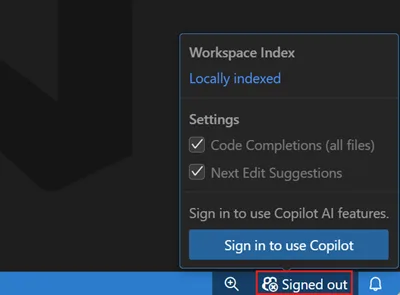

# Getting Started with GitHub Copilot: VS Code & IntelliJ

## เป้าหมายของ module นี้ (5 นาที)

ล็อกอินให้ได้ แล้วยืนยันว่า Copilot ตอบจริง — ดูที่ status bar มุมขวาล่าง

Source: VS Code docs · Microsoft · CC BY 3.0 US

1. ไอคอน Copilot ที่ status bar จะขึ้นว่า **Signed out**
2. คลิกไอคอน แล้วกด **Sign in to use Copilot** — เบราว์เซอร์จะเปิดให้อนุมัติ
3. กลับมาพิมพ์อะไรก็ได้ในไฟล์ ถ้ามีตัวหนังสือสีเทาขึ้น = พร้อมแล้ว ถ้าไม่ขึ้น **ยกมือ**

## 1. VS Code

### ติดตั้ง Copilot Extension
1. เปิด VS Code
2. ไปที่ Extensions (Ctrl+Shift+X)
3. ค้นหา "GitHub Copilot"
4. กด Install

### Sign In ด้วย GitHub
1. หลังติดตั้ง จะมีปุ่ม Sign in with GitHub
2. ทำตามขั้นตอนเพื่อเชื่อมต่อบัญชี

### เริ่มใช้งาน
- พิมพ์โค้ดหรือ comment แล้วดู Copilot แนะนำโค้ด
- ใช้ `Tab` เพื่อยอมรับ suggestion
- สามารถกด `Ctrl+Enter` เพื่อขอ Copilot ช่วยเขียนโค้ดจาก comment

## 2. IntelliJ

### ติดตั้ง Copilot Plugin
1. เปิด IntelliJ IDEA
2. ไปที่ Preferences > Plugins
3. ค้นหา "GitHub Copilot"
4. กด Install

### Sign In ด้วย GitHub
1. หลังติดตั้ง จะมี popup ให้ Sign in
2. ทำตามขั้นตอนเพื่อเชื่อมต่อบัญชี

### เริ่มใช้งาน
- พิมพ์โค้ดหรือ comment แล้วดู Copilot แนะนำโค้ด
- ใช้ `Tab` เพื่อยอมรับ suggestion
- สามารถกด `Alt+Enter` เพื่อขอ Copilot ช่วยเขียนโค้ดจาก comment

## Tips
- ใช้ comment อธิบาย requirement เพื่อให้ Copilot สร้างโค้ด
- สามารถปรับแต่งการทำงานใน Settings ของแต่ละ IDE

---
**Copilot ต้องใช้ GitHub account ที่มี license Copilot**
