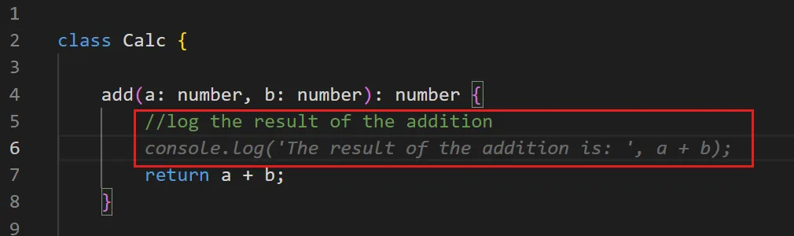

# Convert Comments to Code

## เป้าหมาย
- เรียนรู้การใช้ comment เพื่อให้ Copilot สร้างโค้ด
- ฝึกเขียน comment ที่มีประสิทธิภาพ
- ทดลองสร้างฟังก์ชันซับซ้อนจาก comment

## วิธีการ



<sub>Source: VS Code docs · Microsoft · CC BY 3.0 US</sub>

1. เขียน comment อธิบายสิ่งที่ต้องการให้ฟังก์ชันทำ
2. กด Enter หรือ Ctrl+Enter เพื่อให้ Copilot สร้างโค้ด
3. ปรับแต่งโค้ดที่ได้ตามต้องการ

## แบบฝึกหัด
ลองเขียน comment ภาษาไทยหรืออังกฤษ แล้วให้ Copilot สร้างโค้ด

### เทคนิคการเขียน Comment ที่ดี
- ระบุ input และ output ที่ชัดเจน
- อธิบาย logic หลักที่ต้องการ
- ใช้ภาษาที่เข้าใจง่าย
- ให้ตัวอย่าง input/output ถ้าจำเป็น

## ตัวอย่าง Comment ที่ดี
```javascript
// ฟังก์ชันคำนวณอายุจากวันเกิด รับ parameter เป็น birthDate (Date object) และ return อายุเป็นปี (number)

// ฟังก์ชันตรวจสอบรหัสผ่าน ต้องมีอย่างน้อย 8 ตัวอักษร มีตัวพิมพ์ใหญ่ พิมพ์เล็ก ตัวเลข และอักขระพิเศษ

// ฟังก์ชัน sort array ของ object ตาม property name จากน้อยไปมาก
```
