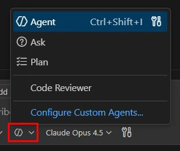

# Code Refactoring & Optimization

## เป้าหมาย
- ใช้ Copilot ในการปรับปรุงโค้ดที่มีอยู่
- **ฝึกนิสัย Ask ก่อน แล้วค่อย Agent**
- ลดโค้ดซ้ำซ้อน (Code Duplication)
- ปรับปรุง Performance
- ทำให้โค้ดอ่านง่ายขึ้น

## ลำดับที่ใช้ใน module นี้ 🔁

เปิด `bad-code.js` แล้วทำสองจังหวะนี้กับแต่ละเคส

Source: VS Code docs · Microsoft · CC BY 3.0 US

mode อยู่ใน dropdown ตัวเดียวกันในหน้าต่าง chat สลับไปมาได้ตลอด

| จังหวะ | mode | ทำอะไร |
|---|---|---|
| 1 | **Ask** | เลือกโค้ด แล้วถามว่า "ฟังก์ชันนี้มีปัญหาอะไร" — Ask ไม่แตะไฟล์ ใช้ทำความเข้าใจก่อน |
| 2 | **Agent** | พอเห็นภาพแล้วค่อยสั่ง Agent ให้ลงมือแก้ แล้ว**อ่าน diff ทุกบรรทัดก่อนรับ** |

> ⚠️ ข้ามจังหวะ Ask ไปสั่ง Agent เลยก็ได้ผล แต่ท่านจะไม่รู้ว่ามันแก้ถูกหรือเปล่า
> ในคลาสมีเวลา 5 นาที ทำสัก 2 เคสพอ ที่เหลือมีห้าเคสให้ทำต่อเองได้

## ทำแต่ละเคสยังไง

ทุกเคสใช้สองจังหวะเดิม เปลี่ยนแค่คำถาม

### 1. การลดโค้ดซ้ำซ้อน (เคสที่ 1)
- เลือกสองฟังก์ชันที่ซ้ำกัน
- **Ask** — "สองฟังก์ชันนี้ซ้ำกันตรงไหน แยกอะไรออกมาเป็นฟังก์ชันเดียวได้บ้าง"
- **Agent** — สั่งให้แยกตามที่ตกลง แล้วอ่าน diff ว่าพฤติกรรมเดิมยังอยู่ครบ

### 2. การปรับปรุง Performance (เคสที่ 2)
- **Ask** — "ฟังก์ชันนี้เป็น Big O เท่าไหร่ ทำให้ดีกว่านี้ได้ไหม อย่างไร"
- **Agent** — สั่งให้เขียนใหม่ตามวิธีที่มันเสนอ แล้วเทียบผลลัพธ์ก่อนกดรับ

### 3. การทำให้โค้ดอ่านง่าย (เคสที่ 3 และ 4)
- **Ask** — "ฟังก์ชันนี้ทำอะไรบ้าง แบ่งเป็นกี่ความรับผิดชอบ"
- **Agent** — สั่งให้แยกเป็นฟังก์ชันย่อยตามที่มันแจกแจงมา

## เทคนิคการ Refactoring
- อ่านโค้ดเดิมก่อนปรับปรุง — นั่นคือหน้าที่ของจังหวะ Ask
- ทำทีละขั้นตอนเล็ก ๆ อย่าสั่ง Agent แก้ทั้งไฟล์รวดเดียว
- บอก Agent ให้ชัดว่าจะแก้อะไร ไม่ใช่ให้มันเดา
- รันเทสต์หลัง refactor ทุกครั้ง
